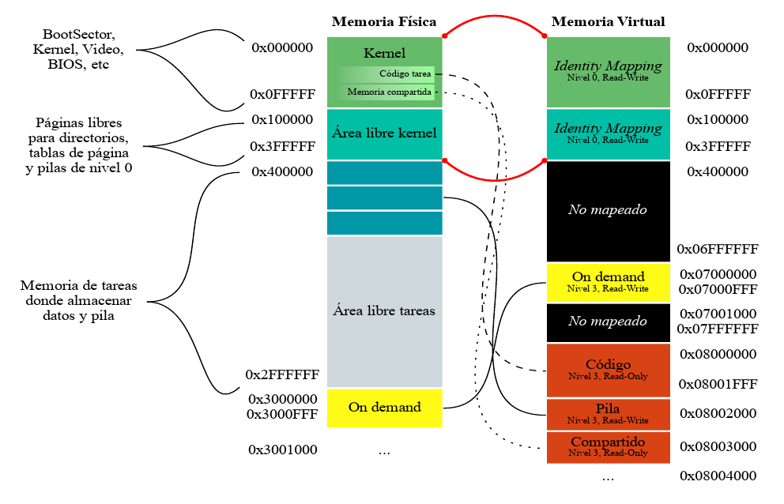

# System Programming: Tareas.

Vamos a continuar trabajando con el kernel que estuvimos programando en
los talleres anteriores. La idea es incorporar la posibilidad de
ejecutar algunas tareas específicas. Para esto vamos a precisar:

-   Definir las estructuras de las tareas disponibles para ser
    ejecutadas

-   Tener un scheduler que determine la tarea a la que le toca
    ejecutase en un período de tiempo, y el mecanismo para el
    intercambio de tareas de la CPU

-   Iniciar el kernel con una *tarea inicial* y tener una *tarea idle*
    para cuando no haya tareas en ejecución

Recordamos el mapeo de memoria con el que venimos trabajando. Las tareas
que vamos a crear en este taller van a ser parte de esta organización de
la memoria:




## Archivos provistos

A continuación les pasamos la lista de archivos que forman parte del
taller de hoy junto con su descripción:

-   **Makefile** - encargado de compilar y generar la imagen del
    floppy disk.

-   **idle.asm** - código de la tarea Idle.

-   **shared.h** -- estructura de la página de memoria compartida

-   **tareas/syscall.h** - interfaz para realizar llamadas al sistema
    desde las tareas

-   **tareas/task_lib.h** - Biblioteca con funciones útiles para las
    tareas

-   **tareas/task_prelude.asm**- Código de inicialización para las
    tareas

-   **tareas/taskPong.c** -- código de la tarea que usaremos
    (**tareas/taskGameOfLife.c, tareas/taskSnake.c,
    tareas/taskTipear.c **- código de otras tareas de ejemplo)

-   **tareas/taskPongScoreboard.c** -- código de la tarea que deberán
    completar

-   **tss.h, tss.c** - definición de estructuras y funciones para el
    manejo de las TSSs

-   **sched.h, sched.c** - scheduler del kernel

-   **tasks.h, tasks.c** - Definición de estructuras y funciones para
    la administración de tareas

-   **isr.asm** - Handlers de excepciones y interrupciones (en este
    caso se proveen las rutinas de atención de interrupciones)

-   **task\_defines.h** - Definiciones generales referente a tareas

## Ejercicios

### Primera parte: Inicialización de tareas

**1.** Si queremos definir un sistema que utilice sólo dos tareas, ¿Qué
nuevas estructuras, cantidad de nuevas entradas en las estructuras ya
definidas, y registros tenemos que configurar?¿Qué formato tienen?
¿Dónde se encuentran almacenadas?

Para definir un sistema que solo utilice dos tareas, debemos definir la TSS de cada tarea con sus registros,  luego indexarla en el array de TSS y subirla a la GDT. Tambien necesitamos añadirlas al scheduler para que se ejecuten. Tambien hay que considerar a las tareas initial y idle que deben formar parte del sistema siempre. Se deberian de configurar los selectores de segmento de forma apropiada, y en especial el selector TR, el cual debemos cargarlo con el descriptor de la TSS de la tarea actual. Tanto el array de TSS, el scheduler y la GDT se encuentran en la memoria del kernel, luego el selector TR es un registro del procesador.

**2.** ¿A qué llamamos cambio de contexto? ¿Cuándo se produce? ¿Qué efecto
tiene sobre los registros del procesador? Expliquen en sus palabras que
almacena el registro **TR** y cómo obtiene la información necesaria para
ejecutar una tarea después de un cambio de contexto.

Se le llama cambio de contexto, al momento donde se debe de guardar la TSS, es decir, el estado del procesador en el momento de ejecución de la tarea, en memoria, para sobreescribirla por la TSS de la tarea siguiente. El registro TR guarda el selector de segmento de la TSS que apunta a su posicion en la GDT, asi obtiene la información para poder ejecutar la tarea despues del cambio, ya que en el descriptor se encuentra la base de la TSS y puede acceder a todo el contexto.

**3.** Al momento de realizar un cambio de contexto el procesador va
almacenar el estado actual de acuerdo al selector indicado en el
registro **TR** y ha de restaurar aquel almacenado en la TSS cuyo
selector se asigna en el *jmp* far. ¿Qué consideraciones deberíamos
tener para poder realizar el primer cambio de contexto? ¿Y cuáles cuando
no tenemos tareas que ejecutar o se encuentran todas suspendidas?

Para poder realizar el primer cambio de contexto deberiamos de tener en cuenta que, la TSS debe de estar bien inicializada y registrada en la GDT y que el jmp debe de tener el selector valido apuntando a la entrada en la GDT de la tarea que queremos saltar. Si no hay tareas que ejecutar, se deberia volver a la tarea idle, tanto si no hay tareas o estan todas suspendidas.

**4.** ¿Qué hace el scheduler de un Sistema Operativo? ¿A qué nos
referimos con que usa una política?

El Scheduler se encarga de decidir que tarea se ejecuta en cada momento. Esto lo decide con una politica arbitraria decidida durante su implementación, en nuestro taller lo tenemos implementado con una politica llamada "Round-robin", donde todas las tareas tienen el mismo tiempo de ejecución y cuando se llega al final de la lista, se vuelve al inicio en bucle. Que todas las tareas tengan el mismo tiempo de ejecución no significa que no haya alguna que tarde mas en completarse, esto puede pasar por la naturaleza de la tarea misma.

**5.** En un sistema de una única CPU, ¿cómo se hace para que los
programas parezcan ejecutarse en simultáneo?

Gracias al scheduler podemos simular que los programas se ejecutan en simultaneo ya que, asigna pequeños fragmentos de tiempo a cada tarea, cuando se termina el intervalo de tiempo dado, se realiza un cambio de contexto, y así para cada tarea. Esto sucede tan rapido que se simula la simultaneidad.

**6.** En **tss.c** se encuentran definidas las TSSs de la Tarea
**Inicial** e **Idle**. Ahora, vamos a agregar el *TSS Descriptor*
correspondiente a estas tareas en la **GDT**.
    
a) Observen qué hace el método: ***tss_gdt_entry_for_task***

b) Escriban el código del método ***tss_init*** de **tss.c** que
agrega dos nuevas entradas a la **GDT** correspondientes al
descriptor de TSS de la tarea Inicial e Idle.

c) En **kernel.asm**, luego de habilitar paginación, agreguen una
llamada a **tss_init** para que efectivamente estas entradas se
agreguen a la **GDT**.

d) Correr el *qemu* y usar **info gdt** para verificar que los
***descriptores de tss*** de la tarea Inicial e Idle esten
efectivamente cargadas en la GDT

**7.** Como vimos, la primer tarea que va a ejecutar el procesador
cuando arranque va a ser la **tarea Inicial**. Se encuentra definida en
**tss.c** y tiene todos sus campos en 0. Antes de que comience a ciclar
infinitamente, completen lo necesario en **kernel.asm** para que cargue
la tarea inicial. Recuerden que la primera vez tenemos que cargar el registro
**TR** (Task Register) con la instrucción **LTR**.
Previamente llamar a la función tasks_screen_draw provista para preparar
la pantalla para nuestras tareas.

Si obtienen un error, asegurense de haber proporcionado un selector de
segmento para la tarea inicial. Un selector de segmento no es sólo el
indice en la GDT sino que tiene algunos bits con privilegios y el *table
indicator*.

**8.** Una vez que el procesador comenzó su ejecución en la **tarea Inicial**, 
le vamos a pedir que salte a la **tarea Idle** con un
***JMP***. Para eso, completar en **kernel.asm** el código necesario
para saltar intercambiando **TSS**, entre la tarea inicial y la tarea
Idle.

**9.** Utilizando **info tss**, verifiquen el valor del **TR**.
También, verifiquen los valores de los registros **CR3** con **creg** y de los registros de segmento **CS,** **DS**, **SS** con
***sreg***. ¿Por qué hace falta tener definida la pila de nivel 0 en la
tss?

Esto es necesario, ya que cuando una tarea de nivel 3 genera una interrupción, el CPU cambia automaticamente al stack de nivel 0, para que se trabaje sobre una pila limpia y porque las interrupciones o excepciones requieren ejecutar codigo del kernel. Aparte el contenido de la pila podria tener contenido peligroso para el kernel o, contenido al que simplemente no podria acceder por permisos.

**10.** En **tss.c**, completar la función ***tss_create_user_task***
para que inicialice una TSS con los datos correspondientes a una tarea
cualquiera. La función recibe por parámetro la dirección del código de
una tarea y será utilizada más adelante para crear tareas.

Las direcciones físicas del código de las tareas se encuentran en
**defines.h** bajo los nombres ***TASK_A_CODE_START*** y
***TASK_B_CODE_START***.

El esquema de paginación a utilizar es el que hicimos durante la clase
anterior. Tener en cuenta que cada tarea utilizará una pila distinta de
nivel 0.

### Segunda parte: Poniendo todo en marcha

**11.** Estando definidas **sched_task_offset** y **sched_task_selector**:
```
  sched_task_offset: dd 0xFFFFFFFF
  sched_task_selector: dw 0xFFFF
```

Y siendo la siguiente una implementación de una interrupción del reloj:

```
global _isr32
  
_isr32:
  pushad
  call pic_finish1
  
  call sched_next_task
  
  str cx
  cmp ax, cx
  je .fin
  
  mov word [sched_task_selector], ax
  jmp far [sched_task_offset]
  
  .fin:
  popad
  iret
```
a)  Expliquen con sus palabras que se estaría ejecutando en cada tic
    del reloj línea por línea

- Primero se pushean todos los registros de propósito general.
- Se le avisa al pic que se atendió su pedido.
- Se llama a sched_next_task para obtener la siguiente tarea a ejecutar.
- Se copia el task register al registro cx.
- Compara cx con la siguiente tarea a ejecutar.
- Si son la misma tarea, evita saltar de tarea.
- Si no son la misma tarea entonces guarda el selector de la nueva tarea a ejecutar en el espacio de memoria sched_task_selector.
- Hace un jmp far utilizando sched_task_offset (aunque este se ignora) para saltar a la tarea correspondiente y que se almacenen los registros en la tss de la tarea que está terminando de ejecutar. Luego se incorporan los registros almacenados en la tss de la tarea a ejecutar.
- Popea los registros de propósito general, para que cuando continue la tarea que terminó de ejecutar, obtenga los registros que tenía en la ejecución de la tarea previo a entrar en la interrupción.
- Se hace un iret para poder restaurar SS, ESP, EFLAGS, CS, EIP (o EFLAGS, CS, EIP si no hay cambio de privilegio).

b)  En la línea que dice ***jmp far \[sched_task_offset\]*** ¿De que
    tamaño es el dato que estaría leyendo desde la memoria? ¿Qué
    indica cada uno de estos valores? ¿Tiene algún efecto el offset
    elegido?

- Se leen 6 bytes en esa dirección de memoria. Los 4 primeros son el offset, que en este caso se ignoran, y los otros 2 son el selector de la gdt para la tarea a ejecutar.

c)  ¿A dónde regresa la ejecución (***eip***) de una tarea cuando
    vuelve a ser puesta en ejecución?

- Regresa a la dirección que tenía el eip en el momento que se almacenó en la tss, es decir a .fin.


**12.** Para este Taller la cátedra ha creado un scheduler que devuelve
la próxima tarea a ejecutar.

a)  En los archivos **sched.c** y **sched.h** se encuentran definidos
    los métodos necesarios para el Scheduler. Expliquen cómo funciona
    el mismo, es decir, cómo decide cuál es la próxima tarea a
    ejecutar. Pueden encontrarlo en la función ***sched_next_task***.

b)  Modifiquen **kernel.asm** para llamar a la función
    ***sched_init*** luego de iniciar la TSS

c)  Compilen, ejecuten ***qemu*** y vean que todo sigue funcionando
    correctamente.

### Tercera parte: Tareas? Qué es eso?

**14.** Como parte de la inicialización del kernel, en kernel.asm se
pide agregar una llamada a la función **tasks\_init** de
**task.c** que a su vez llama a **create_task**. Observe las
siguientes líneas:
```C
int8_t task_id = sched_add_task(gdt_id << 3);

tss_tasks[task_id] = tss_create_user_task(task_code_start[tipo]);

gdt[gdt_id] = tss_gdt_entry_for_task(&tss_tasks[task_id]);
```
a)  ¿Qué está haciendo la función ***tss_gdt_entry_for_task***?

- La función tss_gdt_entry_for_task genera una entrada en la gdt correspondiente a la tss pasada por parámetro como puntero. Con esta entrada luego podemos ir a la dirección donde se encuentra la tss de la tarea en cuestión.

b)  ¿Por qué motivo se realiza el desplazamiento a izquierda de
    **gdt_id** al pasarlo como parámetro de ***sched_add_task***?

- Porque sched_add_task espera un selector de la GDT de la tarea y no el id de la GDT. Cómo el selector tiene el índice de la gdt a partir del tercer bit, hay que shiftear tres lugares hacia la izquierda. Como trabajamos con la GDT, el bit de TI va en 0, y como queremos que la tss y el cambio de tarea lo maneje solo el kernel, el RPL va en 00 también. Por eso no nos genera ningún problema simplemente shiftear.

**15.** Ejecuten las tareas en *qemu* y observen el código de estas
superficialmente.

a) ¿Qué mecanismos usan para comunicarse con el kernel?

- Utilizan una syscall llamada syscall_draw. Esta genera una interrupción que luego llama a la función tasks_syscall_draw ubicada en tasks.c. Esta función se encarga de dibujar la screen pasada por parámetro.

b) ¿Por qué creen que no hay uso de variables globales? ¿Qué pasaría si
    una tarea intentase escribir en su `.data` con nuestro sistema?
    
- Creemos que no hay uso de variables globales porque no hay un área de memoria definida donde estas se guarden. De existir debería de cumplirse que una tarea no pise las
variables globales de otra. Si una tarea intentase escribir en su .data con nuestro sistema, se lanzaría un page fault justamente porque no existe página definida
para esa sección.

c) Cambien el divisor del PIT para \"acelerar\" la ejecución de las tareas:
```
    ; El PIT (Programmable Interrupt Timer) corre a 1193182Hz.

    ; Cada iteracion del clock decrementa un contador interno, cuando
    éste llega

    ; a cero se emite la interrupción. El valor inicial es 0x0 que
    indica 65536,

    ; es decir 18.206 Hz

    mov ax, DIVISOR

    out 0x40, al

    rol ax, 8

    out 0x40, al
```

**16.** Observen **tareas/task_prelude.asm**. El código de este archivo
se ubica al principio de las tareas.

a. ¿Por qué la tarea termina en un loop infinito?

- Entendemos que la tarea termina en un loop infinito porque la idea es que justamente no termine y se quede todo el tiempo activa esperando interrupciones. Es decir, nosotros
interactuamos con las tareas a través del teclado. Esto genera una interrupción que genera la actualización correspondiente en el juego. Por otro lado, es a través de las
interrupciones de reloj que se actualiza la pantalla para darle el feedback al usuario

b. \[Opcional\] ¿Qué podríamos hacer para que esto no sea necesario?

### Cuarta parte: Hacer nuestra propia tarea

Ahora programaremos nuestra tarea. La idea es disponer de una tarea que
imprima el *score* (puntaje) de todos los *Pongs* que se están
ejecutando. Para ello utilizaremos la memoria mapeada *on demand* del
taller anterior.

#### Análisis:

**18.** Analicen el *Makefile* provisto. ¿Por qué se definen 2 "tipos"
de tareas? ¿Como harían para ejecutar una tarea distinta? Cambien la
tarea S*nake* por una tarea *PongScoreboard*.

- Se definen 2 "tipos" de tareas porque, a pesar de tener 4 tareas en nuestro sistema, además de la idle y la inicial, son dos los códigos de las tareas. Podemos decir
que el tipo determina la dirección física donde se encuentra el código de la tarea. En este caso, cada código ocupa dos páginas. Definir varias tareas cuyo código sea
el mismo es la manera de definir varias tareas del mismo tipo.

Para ejecutar una tarea distinta modificamos TASKB para que sea PongScoreboard en lugar de Snake. Si se desea agregar un tercer tipo de tarea en el makefile se debe
agregar su declaración, agregarla a TASKBINS y a tasks: entre TASKB y TASKIDLE on seek=16k y count=8k, queda la idle con seek=24k. En
task_defines.h se debería agregar la posición de inicio del código de la nueva tarea en 0x0001C000, quedando la idle en 0x0001E000. En tasks.c,
agregaríamos TASK_C en el enum tipo_e con el valor 2, y al array task_code_start le agregamos la entrada [TASK_C] = TASK_C_CODE_START.

Por último,
con el siguiente código en tasks_init:

```
task_id = create_task(TASK_C);
sched_enable_task(task_id);
``` 

Ya se podría crear una tarea de tipo C y luego habilitarla en el scheduler, es decir cambiarle el estado a RUNNABLE para que este la pueda elegir.

**19.** Mirando la tarea *Pong*, ¿En que posición de memoria escribe
esta tarea el puntaje que queremos imprimir? ¿Cómo funciona el mecanismo
propuesto para compartir datos entre tareas?

- La posición de memoria que esta tarea escribe el puntaje que queremos imprimir es a partir de 0x07000F00. La misma se encuentra dentro de la página definida como
on demand durante la paginación. Cada tarea de Pong escribe 2 datos de 32 bits, para no pisar los de otra tarea se encuentran definidos luego de la posición
0x07000F00 los primeros 64 bits para la tarea cuyo índice es 1, los siguientes 64 para aquella cuyo índice es 2, los siguientes 64 para aquella con índice 3 y los
últimos 64 para la tarea de índice 4. Estos índices son los que asigna el scheduler al cargar las tareas en su lista de tareas.

Entonces, el mecanismo propuesto para compartir datos entre tareas es escribiendo y leyendo la memoria on demand. Si una tarea desea leer los puntajes de las demás,
debe simplemente consultar las posiciones de memoria explicadas anteriormente.

#### Programando:

**20.** Completen el código de la tarea *PongScoreboard* para que
imprima en la pantalla el puntaje de todas las instancias de *Pong* usando los datos que nos dejan en la página compartida.

**21.** \[Opcional\] Resuman con su equipo todas las estructuras vistas
desde el Taller 1 al Taller 4. Escriban el funcionamiento general de
segmentos, interrupciones, paginación y tareas en los procesadores
Intel. ¿Cómo interactúan las estructuras? ¿Qué configuraciones son
fundamentales a realizar? ¿Cómo son los niveles de privilegio y acceso a
las estructuras?

**22.** \[Opcional\] ¿Qué pasa cuando una tarea dispara una
excepción? ¿Cómo podría mejorarse la respuesta del sistema ante estos
eventos?
